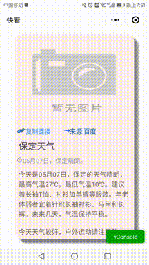

# readquickly_WeChatSmallApp

> A WeChat small app name as readquickly

## ReadQuickly 前端

> 快看(ReadQuickly)小程序 会自动整合多来源的天气、新闻资讯，向用户提供一份可快速查看的信息集合。

### 实现一览

- 实现了位置信息获取，调用腾讯地理位置服务API
- 实现动态修改卡片的内容，以四张卡片容器展示所有内容
- 实现滑动卡片的过渡动画效果，识别左右滑动
- 实现了卡片内容的排版，以及复制原文链接的功能
- 其他一些细节处理，比如爬取的数据若无原文链接，则复制后为百度搜索title相关内容，若无图片则统一给出一张图片提示
-  ···

### 效果图



## ReadQuickly 后端

> ReadQuickly 后端自动整合来自百度大脑以及各种爬虫获取的数据，向前端提供格式统一、内容精简的新闻简讯。

### 目录结构

```
>-- Server		[后端包]
    |-- __init__.py
    |-- server.py   (请求服务器)
    |-- content.py  (整合响应数据)
    >-- spider		[爬虫包]
        |-- __init__.py
        |-- driver.py   (驱动各爬虫实现运行)
        |-- superSpider.py   (爬虫接口)
        |-- newsDatabase.py (数据库读写接口)
        |-- cctvKuaikan.py  (爬虫实现: CCTV快看)
        |-- kr36NewsFlashes.py  (爬虫实现: 36Kr快讯)
        |-- wieboPeoplesDaily.py    (爬虫实现: 人民日报微博)
    >-- weather		[天气包]
        |-- __init__.py
        |-- weather.py  (天气简讯实现)
    >-- notice		[通知包]
        |-- __init__.py
        |-- driver.py   (手动消息接入的交互实现)
        |-- superNotice.py   (手动消息接口)
        |-- noticeDatabase.py   (数据库读写接口)
         
```

### 环境依赖

* MongoDB v4+
* Python 3.6+
* Flask 1.0+
* Jinja2
* Requests
* Lxml
* BeautifulSoup
* PyMongo

###  配置说明

1. 开启 MongoDB 服务

```bash
sudo service mongod start
```

2. 导入环境变量

```bash
export FLASK_APP=/Users/c/readquickly_WeChatSmallApp/Server/server.py
```

3. 开启服务

```bash
flask run --host=0.0.0.0
```

4. 服务检测

   浏览器访问 `http://127.0.0.1:5000` 若请求成功则配置有很大可能已经配置成功。

### 服务实现

ReadQuickly 后端使用了 Flask 框架来处理请求服务以及后台操作。 

目前可用路由如下：

* `/` ：连通测试
* `/readquickly/api/getnews` ：处理前端请求数据
* `/readquickly/admin/notice` ：手动添加通知数据
* `/readquickly/refresh` ：刷新爬虫数据

---

【注】关于 notice 的添加：

notice 也可以调用 api 来发送数据（详见 `server.py`），但要注意**传入数据务必整理成标准的 `useful list`**，同时**增加一项    `{"expires": "<Expires Time>"}`**，否则*调用不会成功*，或可能*引起服务挂起*！